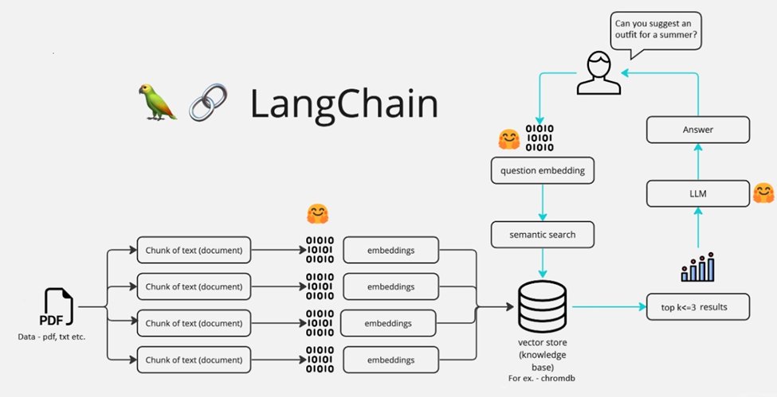

# 🤖MedicalCareBot: Your AI Medical Companion 💊🩺
----------------------------------------------------------
### Report & Other Document: Available in github Repo [Medical_book.pdf ]
----------------------------------------------------------
## What is MedicalCareBot?
MedicalCareBot 🤖 is a sophisticated chatbot designed to provide personalized medical advice and prescriptions. Leveraging a user's natural language queries, it offers recommendations on treatments, medications, and medical advice directly from a curated medical knowledge base.

## 🔗 Links

- GitHub repo link: [Link to repository](https://github.com/Pratikgirade)
- Drive link (Screenshots): [Drive link here](https://drive.google.com/drive/folders/1BPsnG4dGkSXDEvNIk5FAyBg4-OQUFdLA?usp=drive_link)
- Website link: [Deployed link here]()

## How It Is Built?

**FashionBot** utilizes several advanced technologies:

- **Streamlit**: Delivers an interactive user interface for real-time user interaction.
- **LangChain**: Integrates the language model (LLM) with the vector database.
- **RecursiveTextSplitter**: Splits the PDF containing fashion data into manageable chunks.
- **Hugging Face's sentence-transformers/all-MiniLM-L6-v2 Model**: Creates text embeddings.
- **Chroma Vector Database**: Efficiently stores and retrieves text embeddings for semantic search.
- **Meta-Llama-3-8B-Instruct with HuggingFace API**: Provides the processing power for natural language understanding.
- **Directive-based prompt pattern**: Guides the language model on how to generate appropriate responses based on the query context and user interaction directives.

## Architecture Overview


## Instructions on How to Setup and Run

### Step 1: Install Required Python Libraries

Install the necessary libraries from the requirements.txt file:

```bash
pip install -r requirements.txt
```
### Step 2: Generate and Store Embeddings
There are two Python files: `embeddings_generator.py` and `WaLL-E.py`.

1. **Set Up API Keys**: Ensure your HuggingFace API Token is in the .env file
```bash
HUGGINGFACEHUB_API_TOKEN = "<HUGGINGFACEHUB_API_TOKEN>"
```
2. **Generate Embeddings**: Run `vector_embeddings.py` to process the fashion data PDF and store the results in the Chroma Vector Database in the **"data"** directory.
```bash 
python vector_embeddings.py
```

### Step 3: Launch FashionBot
After setting up the embeddings, launch the FashionBot interface by running:
```bash
streamlit run FashionBot.py
```

### Step 4: Testing and Evaluation
MedicalCareBot 🤖 can handle diverse queries such as:

Detailed advice on treatments for specific medical conditions.
Recommendations for medications based on symptoms.
Guidance on health management and lifestyle changes.
Medical tips for understanding prescriptions and side effects.

Examples include:

-- ***Simple Query***: "What are the recommended treatments for hypertension?"
-- ***Complex Query***: "Can you suggest a treatment plan for someone with type 2 diabetes and high cholesterol?"
-- ***Scenario-Based Query***: "I have a cold and a cough. Could you please suggest medications and home remedies?"
-- ***Irrelevant/Out-of-Scope Queries***: "What is the best way to bake a cake?"
-- ***Misspelled Queries***: "mediction recomenndations for diabties?"

